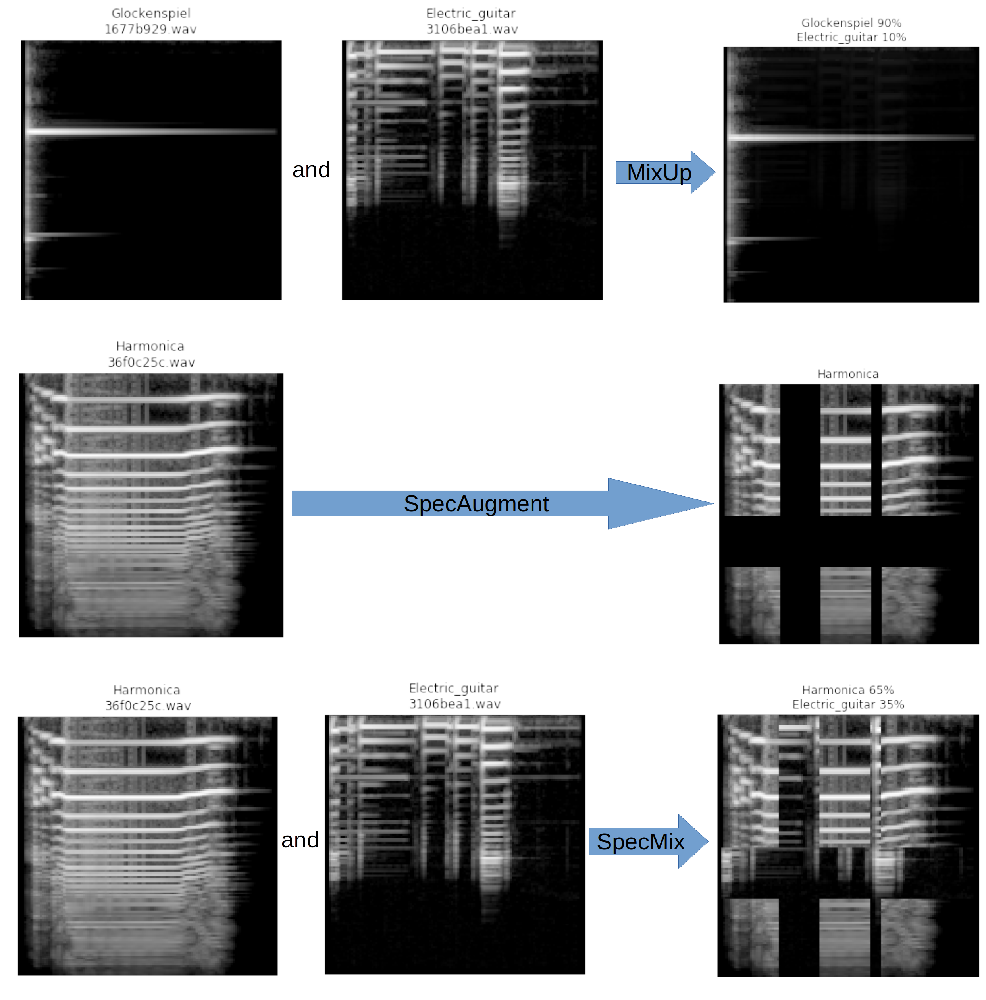
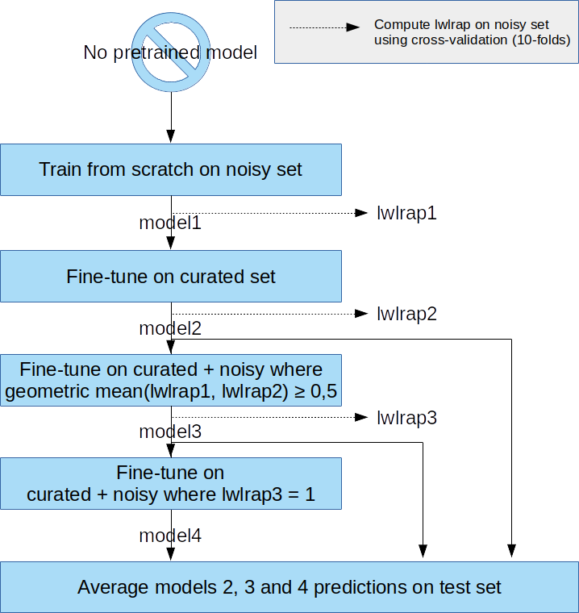

# Kaggle Freesound Audio Tagging 2019 Competition - Eric BOUTEILLON's Solution

This is the solution I proposed for [Kaggle Freesound Audio Tagging 2019 Competition](https://www.kaggle.com/c/freesound-audio-tagging-2019/overview).

[](LICENSE) [ ](https://www.kaggle.com/c/freesound-audio-tagging-2019/leaderboard)

## Presentation

This repository presents a semi-supervised **warm-up pipeline** used to create an efficient audio tagging system as well as a novel data augmentation technique for multi-labels audio tagging named by the author **SpecMix**.

These new techniques were applied to our submitted audio tagging system to the Kaggle _Freesound Audio Tagging 2019_ challenge carried out within the _DCASE 2019 Task 2 challenge_ [3]. Purpose of this challenge consist of predicting the audio labels for every test clips using machine learning techniques trained on a small amount of reliable, manually-labeled data, and a larger quantity of noisy web audio data in a multi-label audio tagging task with a large vocabulary setting.

## TL;DR - give me code!

Provided Jupyter notebooks result in a [lwlrap](https://www.kaggle.com/c/freesound-audio-tagging-2019/overview/evaluation) of .738 in public leaderboard, that is to say 12th position in this competition.

- [Training CNN model 1](code/training-cnn-model1.ipynb)
- [Training VGG16 model](code/training-vgg16.ipynb)
- [Inference kernel](code/inference-kernel.ipynb)

You can also find resulting weights of CNN-model-1 and VGG-16 training in [weights directory](weights). Note [git-lfs](https://git-lfs.github.com/) might be required to download them using git.

## Installation

This competition required to performed inference in a Kaggle kernel without change in its configuration. So it was important to use same version of pytorch and fastai as the Kaggle kernel configuration during the competition to be able to load locally generated CNN weights. So it is important to use pytorch 1.0.1 and fastai 1.0.51.

#### Installation method 1
To get same configuration as my local system, here are the steps, tested on GNU Linux Ubuntu 18.04.2 LTS:

1. Get this repository

2. Install [anaconda3](https://docs.anaconda.com/anaconda/install/)

3. Type in a linux terminal:

```bash
conda create --name freesound --file spec-file.txt
```

You are ready to go!

**Note:** My configuration has CUDA 10 installed, so you may have to adapt version of pytorch and cudatoolkit to your own configuration in the `spec-file.txt`.

#### Installation method 2

This method does not guarantee to get the exact same configuration as newer package may be installed.

1. Get this repository

2. Install [anaconda3](https://docs.anaconda.com/anaconda/install/)

3. Type in a linux terminal:

```bash
conda update conda
conda create -n freesound python=3.7 anaconda
conda activate freesound
conda install numpy pandas scipy scikit-learn matplotlib tqdm seaborn pytorch==1.0.1 torchvision cudatoolkit=10.0 fastai==1.0.51 -c pytorch -c fastai
conda uninstall --force jpeg libtiff -y
conda install -c conda-forge libjpeg-turbo
CC="cc -mavx2" pip install --no-cache-dir -U --force-reinstall --no-binary :all: --compile pillow-simd
conda install -c conda-forge librosa
```

**Notes:**
- My configuration has CUDA 10 installed, so you may have to adapt version of pytorch and cudatoolkit to your own configuration
- You may have inconsistency warnings because we use libjpeg-turbo

## Reproduce results

1. Download [dataset from Kaggle](https://www.kaggle.com/c/freesound-audio-tagging-2019/data)

2. Unpack dataset in `input` folder so you environment looks like:

```bash
├── code
│   ├── inference-kernel.ipynb
│   ├── training-cnn-model1.ipynb
│   └── training-vgg16.ipynb
├── images
│   ├── all_augmentations.png
│   └── model-explained.png
├── input
│   ├── test
│   │   └── ...
│   ├── train_curated
│   │   └── ...
│   ├── train_noisy
│   │   └── ...
│   ├── sample_submission.csv
│   ├── train_curated.csv
│   ├── train_noisy.csv
│   └── keep.txt
├── LICENSE
├── README.md
├── requirements.txt
├── spec-file.txt
└── weights
    ├── cnn-model-1
    │   └── work
    │       ├── models
    │       │   └── keep.txt
    │       ├── stage-10_fold-0.pkl
    │       ├── ...
    │       └── stage-2_fold-9.pkl
    └── vgg16
        └── work
            ├── models
            │   └── keep.txt
            ├── stage-10_fold-0.pkl
            ├── ...
            └── stage-2_fold-9.pkl
```

3. Type in command-line:

```bash
conda activate freesound
jupyter notebook
```

Your web-browser should open and then select the notebook you wanna execute.

- [training-cnn-model1.ipynb](code/training-cnn-model1.ipynb)
- [training-vgg16.ipynb](code/training-vgg16.ipynb)
- [inference-kernel.ipynb](code/inference-kernel.ipynb)

Enjoy!

**Notes:**

- Run first a `training-*.ipynb` notebook to train one of the models. :smile:
- During CNN model training, a `work` folder and a `preprocessed` folders will be created, you may want to change their location: it is as easy as updating variables `WORK`and `PREPROCESSED`.
- If you want to use the provided weights (or your own) with the inference notebook on your local setup, simply update folder paths pointed by `models_list`. I kept the paths used within the Kaggle kernel for the competition.

## Solution Description

### Audio Data Preprocessing

Audio clips were first trimmed of leading and trailing silence (threshold of 60 dB), then converted into 128-bands mel-spectrogram using a 44.1 kHz sampling rate, hop length of 347 samples between successive frames, 2560 FFT components and frequencies kept in range 20 Hz – 22,050 Hz. Last preprocessing consisted in normalizing (mean=0, variance=1) the resulting images and duplicating to 3 channels.

### Models Summary

In this section, we describe the neural network architectures used:

**Version 1** consists in  an ensemble of a custom CNN &quot;CNN-model-1&quot; defined in Table 1 and a VGG-16 with batch-normalization. Both are trained in the same manner.

**Version 2** consist of only our custom CNN &quot;CNN-model-1&quot;, defined in Table 1.

**Version 3** is evaluated for Judge award and it is same model as version 2.

| Input 128 × 128 × 3 |
| --- |
| 3 × 3 Conv(stride=1, pad=1)−64−BN−ReLU |
| 3 × 3 Conv(stride=1, pad=1)−64−BN−ReLU |
| 3 × 3 Conv(stride=1, pad=1)−128−BN−ReLU |
| 3 × 3 Conv(stride=1, pad=1)−128−BN−ReLU |
| 3 × 3 Conv(stride=1, pad=1)−256−BN−ReLU |
| 3 × 3 Conv(stride=1, pad=1)−256−BN−ReLU |
| 3 × 3 Conv(stride=1, pad=1)−512−BN−ReLU |
| 3 × 3 Conv(stride=1, pad=1)−512−BN−ReLU |
| concat(AdaptiveAvgPool2d + AdaptiveMaxPool2d) |
| Flatten−1024-BN-Dropout 25% |
| Dense-512-Relu-BN-Dropout 50% |
| Dense-80 |

Table 1: CNN-model-1. BN: Batch Normalisation, ReLU: Rectified Linear Unit,

### Data Augmentation

One important technique to leverage a small training set is to augment this set using data augmentation. For this purpose we created a new augmentation named **SpecMix**. This new augmentation is an extension of _SpecAugment_ [1] inspired by _mixup_ [2].

**SpecAugment** applies 3 transformations to augment a training sample: time warping, frequency masking and  time masking on mel-spectrograms.

**mixup** creates a virtual training example by computing a weighted average of two samples inputs and targets.

#### SpecMix

**SpecMix** is inspired from the two most effective transformations from  _SpecAugment_ and extends them to create virtual multi-labels training examples:

1. _Frequency replacement_ is applied so that _f_ consecutive mel-frequency channels _[f0, f0+f)_ are replaced from another training sample, where _f_ is first chosen  from  a  uniform  distribution  from  minimal  to maximum the frequency  mask  parameter _F_,  and _f0_ is  chosen  from _[0, ν−f)_. _ν_ is the number of mel frequency channels.
2. _Time replacement_ is applied so that _t_ consecutive time steps _[t0, t0+t)_ are replaced from another training sample,  where _t_ is first chosen from a uniform distribution from 0 to the time mask parameter _T_, and _t0_ is chosen from _[0, τ−t)_.  _τ_ is the number of time samples.
3. _Target_ of the new training sample is computed as the weighted average of each original samples. The weight for each original sample is proportional to the number of pixel from that sample. Our implementation uses same replacement sample for _Frequency replacement_ and _Time replacement_, so it gives us a new target computed based on:

                (1)

        where

Figure 1: Comparison of mixup, SpecAugment and SpecMix


#### Others data augmentation

We added other data augmentation techniques:

- **mixup** before SpecMix. A small improvement is observed (lwlrap increased by +0.001). mixup is first applied on current batch, generating new samples for the current batch and then SpecMix is applied on these newly created samples. In the end, combining mixup and SpecMix, up to four samples are involved in the generation of one single sample.
- **zoom and crop**  small improvement too (lwlrap increased by +0.001)

### Training

At training time, we give to the network batches of 128  augmented excerpts of randomly selected sample mel-spectrograms. We use a 10-fold cross validation setup.

  Training is done in 4 stages, each stage generating a model which is used for 3 things:

- **warm-up the model** training in the next stage
- help in a **semi-supervised selection** of noisy elements
- participate in the **test prediction** (except model 1)

An important point of this competition, is that we are not allowed to use external data nor pretrained models. So our pipeline presented below only used curated and noisy sets from the competition:

- **Stage 1** : Train a model (model1) from scratch only using the noisy set. Then compute cross-validated lwlrap on noisy set (lwlrap1).
- **Stage 2** : Train a model (model2) only on curated set but use model1 as pretrained model. Then compute cross-validated lwlrap on noisy set (lwlrap2).
- **Stage 3** : Let&#39;s start semi-supervised learning: our algorithm select samples from noisy set that are (almost) correctly classified by both model1 and model2. This algorithm simply keep sample from noisy set getting a geometric mean of (lwlrap1, lwlrap2) higher or equal to 0,5. A maximum of 5 samples per fold and per label is selected. Then train a model (model3) on curated plus selected noisy samples and use model2 as pretrained model. Then compute cross-validated lwlrap on noisy set (lwlrap3).
- **Stage 4** : Let&#39;s continue semi-supervised learning: our algorithm select again samples from noisy set that are strictly correctly classified by model3. This algorithm simply keep sample from noisy set getting a lwlrap3 equal to 1. Then train a model (model4) on curated plus selected noisy samples and use model3 as pretrained model.
- **Last stage:** ensemble predictions on test set from model2, model3 and model4.

Figure 2: warm-up pipeline


| Model | lwlrap noisy | lwlrap curated | leaderboard |
| --- | --- | --- | --- |
| model1 | 0.65057 | 0.41096 | N/A |
| model2 | 0.38142 | 0.86222 | 0.723 |
| model3 | 0.56716 | 0.87930 | 0.724 |
| model4 | 0.57590 | 0.87718 | 0.724 |
| ensemble | N/A | N/A | 0.733 |

Table 2: Empirical results of CNN-model-1 using proposed warm-up pipeline

## Hardware / Software

During the competition I use the following:

- Intel Core i7 4790k
- Nvidia RTX 2080 ti
- 24 GB RAM
- Ubuntu 18.04.2 LTS
- Detailed list of installed python package with conda (more than necessary) are available in [requirements.txt](requirements.txt) and [spec-file.txt](spec-file.txt).

## REFERENCES

[1] Daniel S. Park, William Chan, Yu Zhang, Chung-Cheng Chiu, Barret Zoph, Ekin D. Cubuk, Quoc V. Le, &quot;SpecAugment: A Simple Data Augmentation Method for Automatic Speech Recognition&quot;, [arXiv:1904.08779](https://arxiv.org/abs/1904.08779), 2019.

[2] Hongyi Zhang, Moustapha Cisse, Yann N. Dauphin, and David Lopez-Paz.  &quot;_mixup: Beyondempirical risk minimization_&quot;. arXiv preprint arXiv:1710.09412, 2017.

[3] Eduardo Fonseca, Manoj Plakal, Frederic Font, Daniel P. W. Ellis, and Xavier Serra. &quot;Audio tagging with noisy labels and minimal supervision&quot;. Submitted to DCASE2019 Workshop, 2019. URL: [https://arxiv.org/abs/1906.02975](https://arxiv.org/abs/1906.02975)
